# AgroStore — Cold Storage Booking for Farmers

AgroStore lets Bangladeshi farmers find refrigerated cold storage near them, reserve capacity **by the kilogram for exact dates**, and pay online. Warehouse owners list their chambers and run a booking queue; admins verify listings, grade produce at intake, handle refunds and audit every action.

This repository is the **Next.js frontend**. It consumes the AgroStore REST API (Express 5 + Prisma + PostgreSQL), built for B7A6.

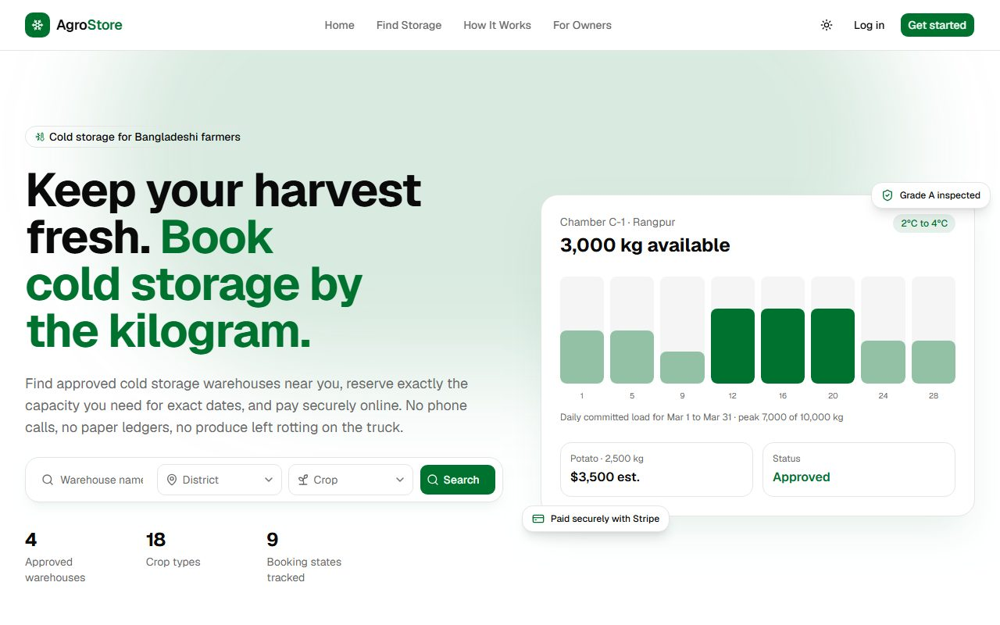

## Links

| | |
|---|---|
| Live frontend | https://agrostore-cyan.vercel.app |
| Live backend | https://sojibislam9878assignment6.vercel.app (API under `/api/v1`) |
| Frontend repo | https://github.com/sojibislam9878/la-a7 |
| Backend repo | https://github.com/sojibislam9878/l2-a6 |
| API documentation | [Backend README, endpoint reference](https://github.com/sojibislam9878/l2-a6#readme) |

## Demo accounts

The login page has **one-click demo login** buttons for all three roles. The same accounts also work with the regular form:

| Role | Email | Password | What to try |
|---|---|---|---|
| Admin | `admin@gmail.com` | `12345678` | Approve warehouses, record intake inspections, refund payments, ban users, read the audit log |
| Farmer | `farmer1@gmail.com` | `f12345678` | Search, book a chamber, pay with Stripe, request withdrawal, review |
| Warehouse owner | `warehouse1@gmail.com` | `w12345678` | Manage warehouses and chambers, approve, store and release lots |

Stripe runs in **test mode**. Pay with card `4242 4242 4242 4242`, any future expiry, any CVC.

## The three roles

**Farmer**
- Searches approved warehouses by district, crop, capacity, price and rating, and checks live free capacity for their dates.
- Books a chamber whose temperature range fits the crop, then pays on Stripe Checkout once the owner approves.
- Follows the lot through approval → payment → intake grading → storage → withdrawal, with an invoice that settles on the days actually stored.
- Manages payments, reviews and a farming profile.

**Warehouse owner**
- Completes a business profile (trade license, NID) before any owner action is unlocked.
- Lists warehouses (reviewed by an admin before they go live) and chambers with their own temperature range and capacity, and can pause a chamber.
- Works a booking queue per warehouse: approve or reject requests, mark paid lots as stored, release lots and settle the final bill.

**Admin**
- Sees platform insights: bookings by stage, warehouses by status, capacity, users by role, top districts.
- Approves, rejects, suspends and reinstates warehouses; bans users and changes roles.
- Records the intake inspection (grade, weighed quantity, moisture). A rejected lot cancels the booking.
- Refunds payments (a "Refund due" view lists paid bookings that were cancelled), manages crop types, and reads a filterable audit log with before/after values.

## Screenshots

| | |
|---|---|
| 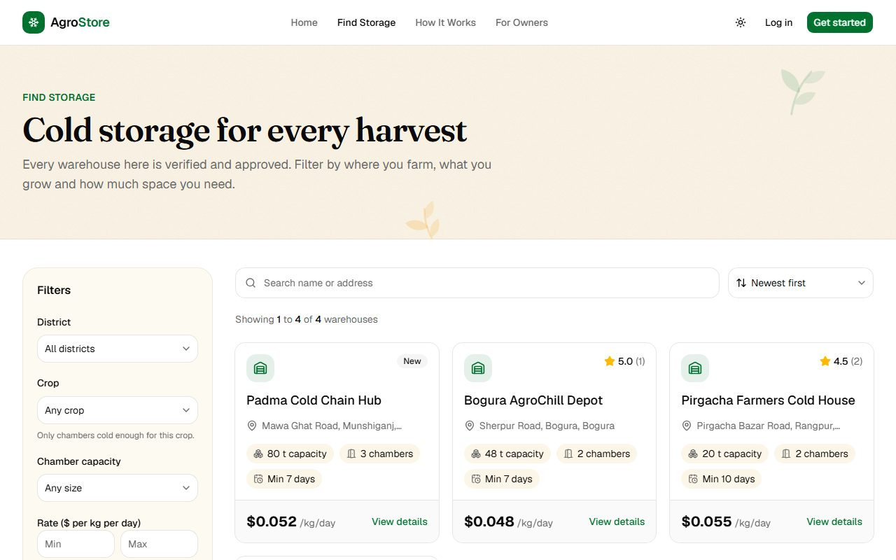 Search with URL-driven filters | 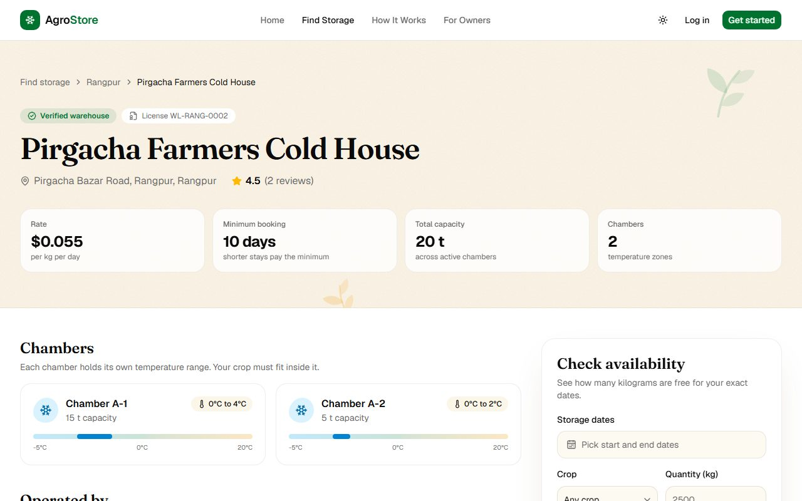 Warehouse detail and availability check |
| 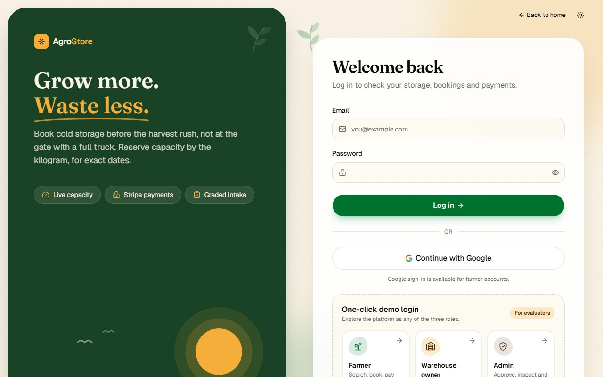 Login with one-click demo buttons | 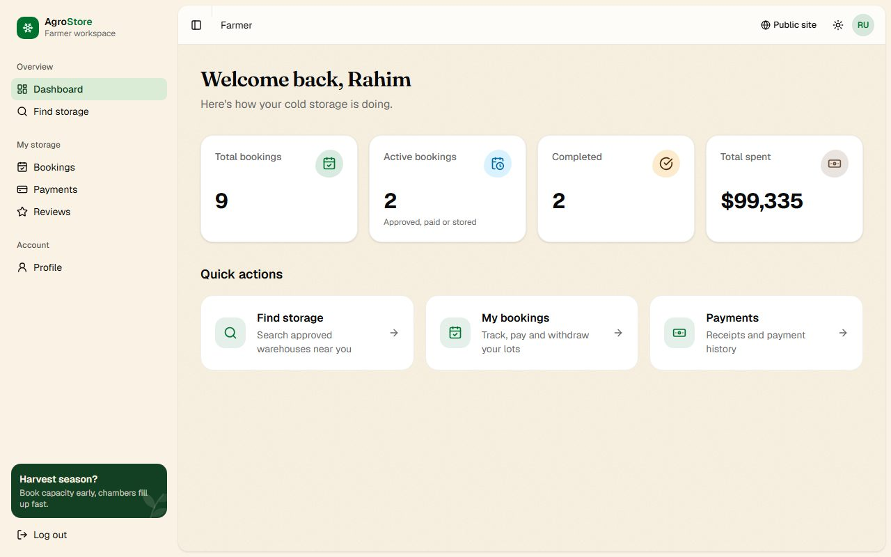 Farmer dashboard |
| 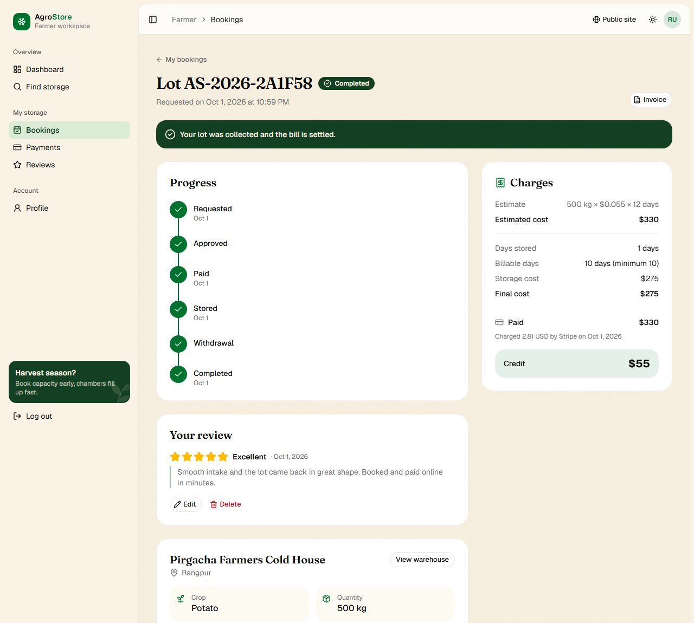 Booking lifecycle, review and settled bill | 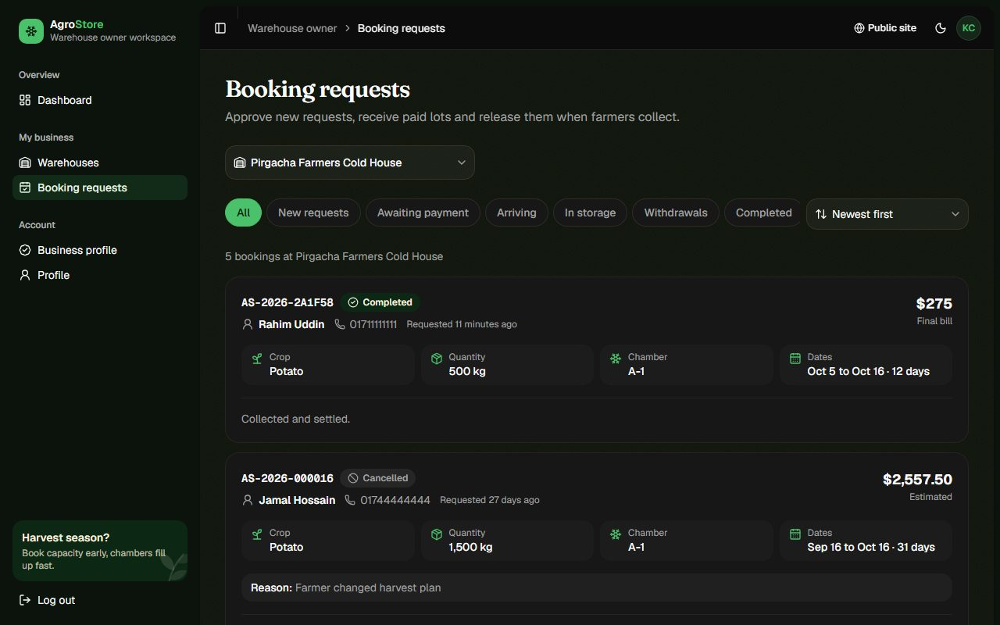 Owner booking queue (dark mode) |
| 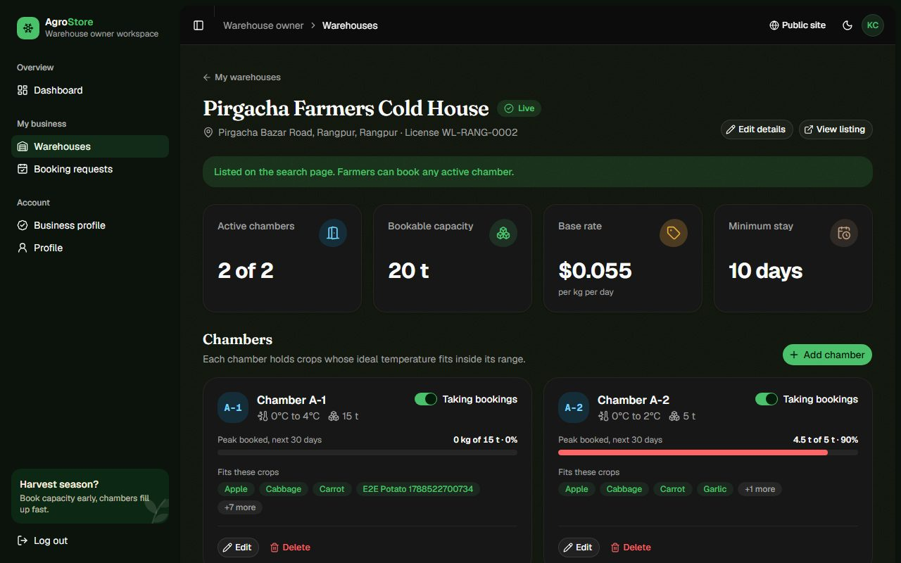 Chambers with 30-day peak load | 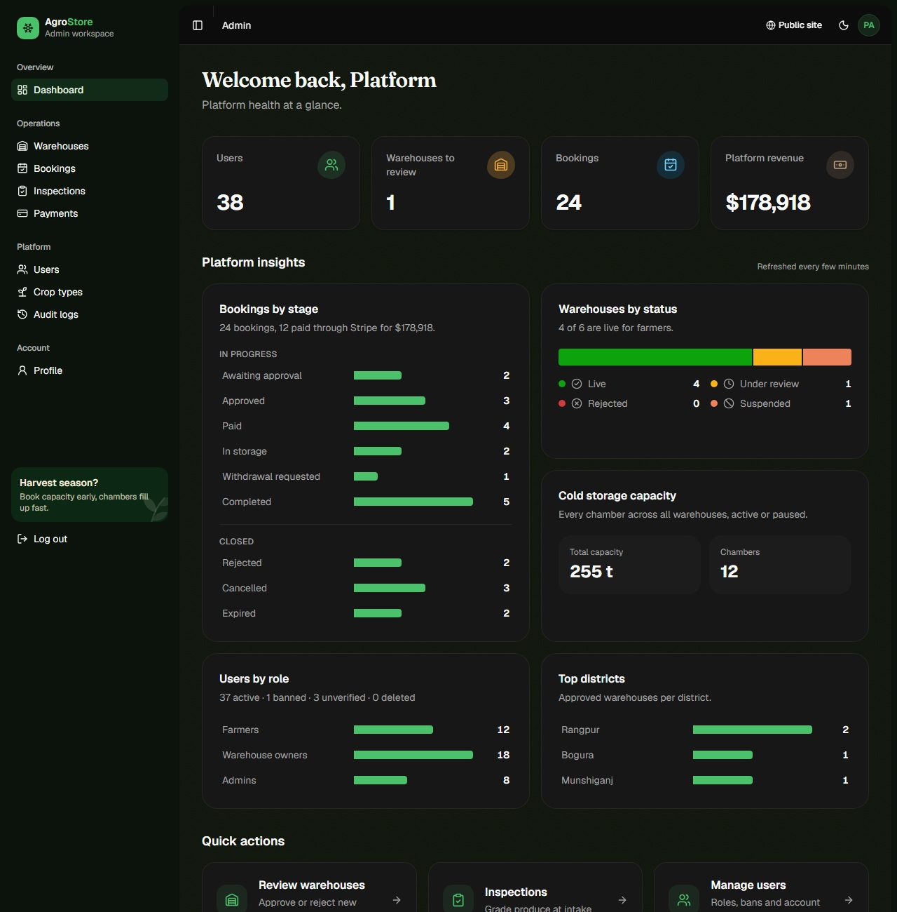 Admin platform insights |
| 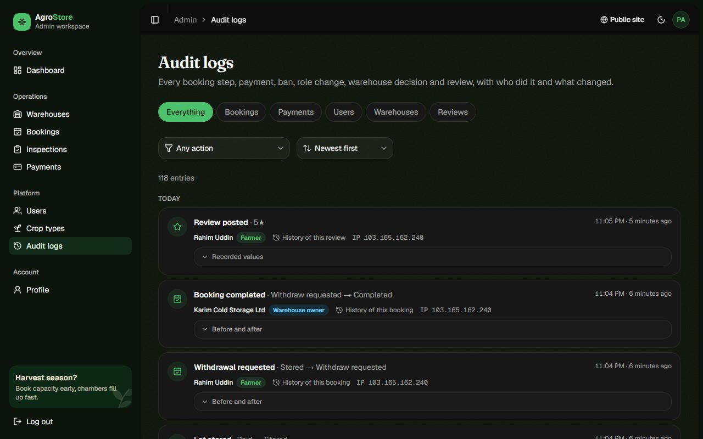 Audit log with before/after values | 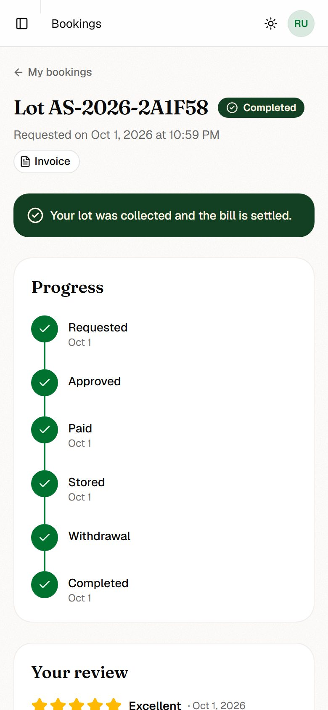 Phone layout |

## Tech stack

| Concern | Choice |
|---|---|
| Framework | Next.js 16 (App Router, Turbopack), React 19, TypeScript |
| Styling | Tailwind CSS v4, shadcn/ui on Radix primitives, lucide icons, `next-themes` for light/dark |
| Server state | TanStack Query v5 (caching, `keepPreviousData`, optimistic updates with rollback) |
| Client state | Zustand (session and access token, kept in memory) |
| Forms | React Hook Form + Zod, with schemas that mirror the backend rules |
| Payments | Stripe Checkout (test mode), confirmed by the backend webhook |
| Charts | Plain HTML/CSS bars; Recharts only for the chamber load chart, loaded on demand |
| Hosting | Vercel |

## Architecture

### App Router and the Server/Client split

```
app/
├── (public)/      landing, /warehouses, /warehouses/[id], /how-it-works, /for-owners, /crop-guide, /faq,
│                  /payment/success, /payment/failed (Stripe return pages)
├── (auth)/        /login, /register, /verify-otp
├── (dashboard)/   /farmer/*, /owner/*, /admin/*  (role-guarded sidebar layout)
├── actions/       Server Actions (cache invalidation)
├── layout.tsx     fonts, theme, providers, metadata, skip link
├── error.tsx  not-found.tsx  robots.ts  sitemap.ts  opengraph-image.tsx  icon.svg
proxy.ts           route protection (Next 16 "middleware")
```

- **Server Components by default.** Public pages (landing, search, warehouse detail, crop guide) fetch on the server with Next caching (`fetch` with `revalidate` and tags), so they render with data, are crawlable, and send no data-fetching JavaScript. The marketing pages are prerendered at build time.
- **Client Components only where there is interaction:** forms, dialogs, filters and everything behind login, which depends on the in-memory access token.
- **Streaming and boundaries:** `loading.tsx` skeletons for the dashboard and search routes, `Suspense` around the featured-warehouses strip, `error.tsx` per route group, and a custom 404.
- **Server Action:** after an admin edits crop types, `updateTag("crop-types")` refreshes the server-cached crop list.

### Authentication and authorization

- The access token lives **only in memory** (Zustand). The refresh token is an httpOnly cookie set by the API.
- An expired access token is refreshed once and the request retried. Refreshes are single-flight, with a cross-tab lock, so parallel requests and multiple tabs do not race.
- `proxy.ts` blocks role areas (`/farmer`, `/owner`, `/admin`, `/payment`) using a non-sensitive role cookie and redirects to `/login?redirect=…`. A client `RoleGuard` then confirms the session against the API before rendering.
- Role-based UI: each role gets its own sidebar, dashboard and actions. Owners without a business profile are sent to onboarding and see locked menu items.
- Google sign-in (farmers), email OTP verification, password change and set, and account deletion.

### Data fetching and state

- Query keys are centralised in `lib/query-keys.ts`; every list keeps its filters, sort and page **in the URL** (`useSearchParams`, parsed with Zod).
- Mutations update the cache optimistically and roll back on error: deleting reviews, chambers and crop types, banning users, changing warehouse status, and others. Every mutation reports success or failure with a toast, or with field errors on its form.
- Every page query has a skeleton, an error state with a retry button, and an empty state.

### Forms

React Hook Form + Zod throughout, covering 21 forms: registration, OTP, booking, warehouse, chamber, crop type, inspection, refund, ban, role change, profiles, password and delete account. Server validation errors are mapped back onto the matching fields.

### Payments

1. The farmer clicks **Pay** on an approved booking. The API creates a Stripe Checkout session, and the browser goes to Stripe.
2. Stripe returns to `/payment/success`, which polls the API until the **webhook** marks the booking paid.
3. Admins can refund a payment in full from **Payments**.

### Performance

- The four large form dialogs and the Recharts chart load their code only when opened (`next/dynamic` with a skeleton).
- Server-side caching with `revalidate` and tags; static prerendering for marketing pages.
- There are no raster images in the UI (icons and inline SVG only), so nothing needs `next/image`.
- Metadata on every page, Open Graph and Twitter cards, a generated share image, `robots.txt`, `sitemap.xml`, and `noindex` on dashboards.

### Accessibility

- An axe-core scan of all routes in light and dark mode reports **0 violations**.
- Skip-to-content link, landmarks, labelled controls, visible focus rings, and keyboard-operable dialogs and selects.
- Colour tokens meet WCAG AA contrast, and animations are disabled when the user prefers reduced motion.

## Project structure

```
components/   feature folders (admin, booking, owner, farmer, payment, review, warehouse, landing, …) + ui/ (shadcn)
hooks/        TanStack Query hooks per domain (use-bookings, use-owner-bookings, use-admin-users, …)
lib/api/      typed API clients; authed.ts handles token refresh and retry
lib/*-query.ts URL-state parsers and serializers for every list page
schemas/      Zod schemas for forms
stores/       Zustand auth store
constants/    routes, navigation, status labels, demo accounts
types/        API response types
```

## Running locally

Requirements: Node.js 20+ and a running AgroStore API, either local or the live one.

```bash
git clone https://github.com/sojibislam9878/la-a7.git
cd la-a7
npm install
cp .env.example .env.local
npm run dev
```

Open http://localhost:3000.

| Variable | Example | Purpose |
|---|---|---|
| `NEXT_PUBLIC_API_URL` | `http://localhost:8000` | API base URL, without `/api/v1` |
| `NEXT_PUBLIC_SITE_URL` | `http://localhost:3000` | Public site URL, used for metadata, sitemap and share links |

The API must list your frontend origin in its `FRONTEND_URL` (comma-separated). The live API already allows `http://localhost:3000`.

| Script | |
|---|---|
| `npm run dev` | Development server |
| `npm run build` / `npm start` | Production build and server |
| `npm run lint` | ESLint |
| `npm run typecheck` | TypeScript, no emit |

## Deployment

The frontend is deployed on Vercel, project `agrostore`. Pushes to `main` deploy automatically. Production sets `NEXT_PUBLIC_API_URL` and `NEXT_PUBLIC_SITE_URL`; `.vercelignore` keeps local notes and env files out of the upload.
